# LoadApp.AI Architecture

## 1. System Overview

### High-Level Architecture

```ascii
┌─────────────────────────────────────────┐
│              Frontend Layer             │
├─────────────────────────────────────────┤
│ ┌─────────────┐  ┌──────────────────┐  │
│ │   Pages     │  │    Components    │  │
│ │ - Home      │  │ - RouteInput     │  │
│ │ - Offers    │  │ - RouteDisplay   │  │
│ │ - Settings  │  │ - CostSettings   │  │
│ └─────────────┘  └──────────────────┘  │
└───────────────────────┬─────────────────┘
                        │ HTTP/JSON
                        ▼
┌─────────────────────────────────────────┐
│               API Layer                 │
├─────────────────────────────────────────┤
│ ┌─────────────┐  ┌──────────────────┐  │
│ │  Endpoints  │  │    Middleware    │  │
│ │ - Routes    │  │ - Auth           │  │
│ │ - Costs     │  │ - Validation     │  │
│ │ - Offers    │  │ - Error Handling │  │
│ └─────────────┘  └──────────────────┘  │
└───────────────────────┬─────────────────┘
                        │
                        ▼
┌─────────────────────────────────────────┐
│              Domain Layer               │
├─────────────────────────────────────────┤
│ ┌─────────────┐  ┌──────────────────┐  │
│ │  Services   │  │     Entities     │  │
│ │ - Route     │  │ - Route          │  │
│ │ - Cost      │  │ - Cost           │  │
│ │ - Offer     │  │ - Offer          │  │
│ └─────────────┘  └──────────────────┘  │
└───────────────────────┬─────────────────┘
                        │
                        ▼
┌─────────────────────────────────────────┐
│          Infrastructure Layer           │
├─────────────────────────────────────────┤
│ ┌─────────────┐  ┌──────────────────┐  │
│ │  Database   │  │ External Services│  │
│ │ - PostgreSQL│  │ - Maps API       │  │
│ │ - Migrations│  │ - Weather API    │  │
│ │ - Models    │  │ - Currency API   │  │
│ │             │  │ - CrewAI        │  │
│ └─────────────┘  └──────────────────┘  │
└───────────────────────────────────────
```

### Main Flow Sequence

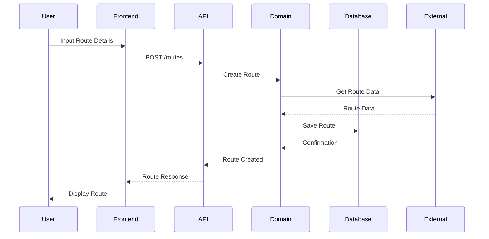

### Component Interactions

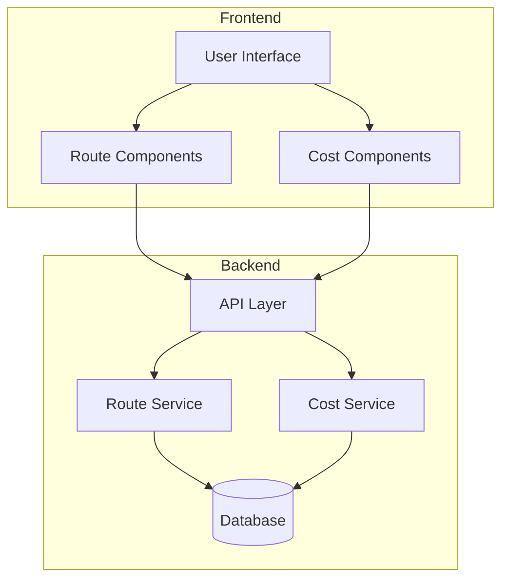

## 2. Core Principles

### Layered Architecture
- Each layer has strict boundaries and responsibilities
- Dependencies flow downward only (upper layers depend on lower layers)
- Each layer communicates through well-defined interfaces
- Changes in one layer should not affect other layers
- Promotes modularity and maintainability

### Domain-Driven Design (DDD)
- Rich domain models that encapsulate business logic
- Ubiquitous language shared between technical and domain experts
- Bounded contexts to manage complexity
- Aggregates to maintain consistency boundaries
- Value objects for immutable concepts
- Entities for objects with identity
- Domain events for cross-boundary communication

### Event Sourcing
- State changes are captured as a sequence of events
- Events are immutable and stored in chronological order
- System state can be reconstructed from event history
- Enables robust audit trails and temporal queries
- Facilitates event-driven integrations with CrewAI

## 3. Project Structure

```
loadapp.ai/
├── frontend/           # Streamlit frontend application
│   ├── pages/         # Application pages
│   ├── components/    # Reusable UI components
│   └── utils/         # Frontend utilities
├── backend/           # Flask API backend
│   ├── api/          # API endpoints and resources
│   ├── domain/       # Domain models and services
│   ├── infra/        # Infrastructure components
│   └── utils/        # Backend utilities
├── tests/            # Test suites
│   ├── unit/        # Unit tests
│   ├── integration/ # Integration tests
│   └── e2e/         # End-to-end tests
├── mock_services/    # Mock external services
│   ├── maps/        # Mock maps API
│   ├── weather/     # Mock weather API
│   └── crewai/      # Mock CrewAI API
└── docs/            # Documentation
    ├── ARCHITECTURE.md           # System architecture
    ├── FRONTEND_GUIDE.md        # Frontend implementation
    ├── DEVELOPER_GUIDE.md       # Development setup
    └── TESTING_INFRASTRUCTURE.md # Testing guide
```

### Key Directory Explanations

#### Backend Structure
- **api/**: REST API implementation
  - `routes/`: API endpoint definitions
  - `middleware/`: Request/response processing
- **domain/**: Core business logic
  - `models/`: Domain entity definitions
  - `services/`: Business logic implementation
  - `validators/`: Business rule validation
- **infrastructure/**: External concerns
  - `database/`: Data persistence
  - `external/`: Third-party service clients
  - `monitoring/`: Logging and metrics

#### Frontend Structure
- **pages/**: Streamlit page implementations
- **components/**: Reusable UI components
- **utils/**: Helper functions and utilities
  - `api_client.py`: Backend API communication
  - `state_management.py`: Streamlit state handling

#### Testing Structure
- **tests/**: Test implementations
  - `api/`: API endpoint tests
  - `domain/`: Business logic tests
  - `infrastructure/`: Database and external service tests
- **mock_services/**: External service mocks

#### Configuration and Documentation
- **docs/**: Project documentation
- **scripts/**: Utility scripts
- `.env.*`: Environment configurations
- `requirements*.txt`: Python dependencies

For detailed implementation information:
- Frontend implementation → [Frontend Guide](FRONTEND_GUIDE.md)
- Development setup → [Developer Guide](DEVELOPER_GUIDE.md)
- Testing setup → [Testing Infrastructure](TESTING_INFRASTRUCTURE.md)

## 4. Layer Details

### Frontend Layer (Streamlit)

For detailed frontend implementation, component patterns, state management, and UI/UX guidelines, please refer to [Frontend Guide](FRONTEND_GUIDE.md).

Key architectural aspects:
- Streamlit-based UI with modular component structure
- State management through Streamlit session state
- REST API communication with backend
- Component-based architecture for reusability

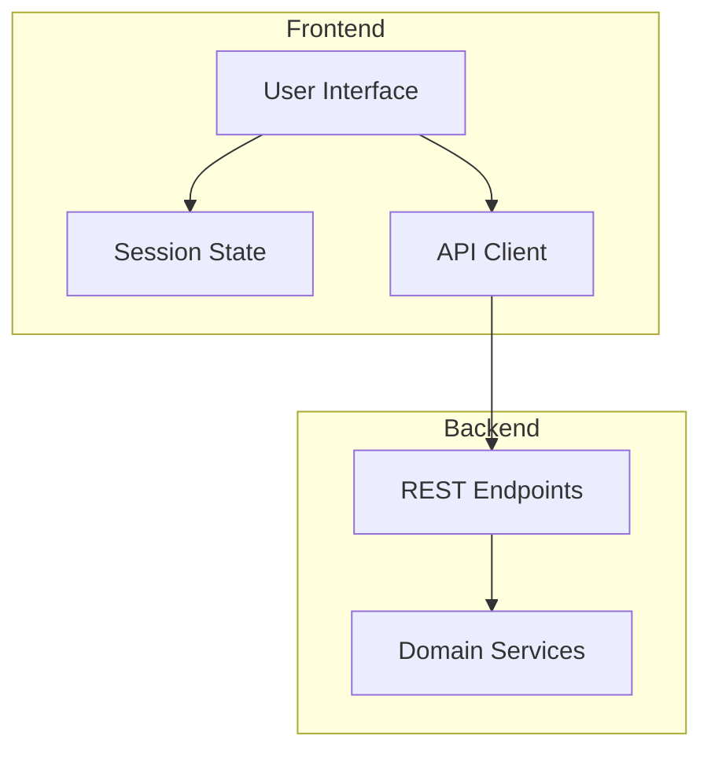

The frontend uses Streamlit's session state for managing application state and makes HTTP requests to the backend API for data operations. Each component follows a consistent pattern:
1. State initialization
2. User interface rendering
3. API communication through REST endpoints
4. State updates based on API responses

### API Layer (Flask-RESTful)

For detailed API implementation, endpoint patterns, and middleware configuration, please refer to [Developer Guide](DEVELOPER_GUIDE.md).

Key architectural aspects:
- RESTful API design with Flask-RESTful
- Middleware chain for authentication, validation, and error handling
- Resource-based endpoint structure
- JSON schema validation for requests/responses

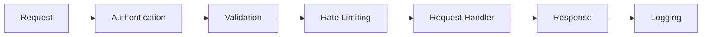

### Domain Layer

For detailed domain implementation, service patterns, and business logic, please refer to [Developer Guide](DEVELOPER_GUIDE.md).

Key architectural aspects:
- Domain-driven design principles
- Service-based business logic encapsulation
- Rich domain models with validation
- Event-driven architecture for cross-domain communication

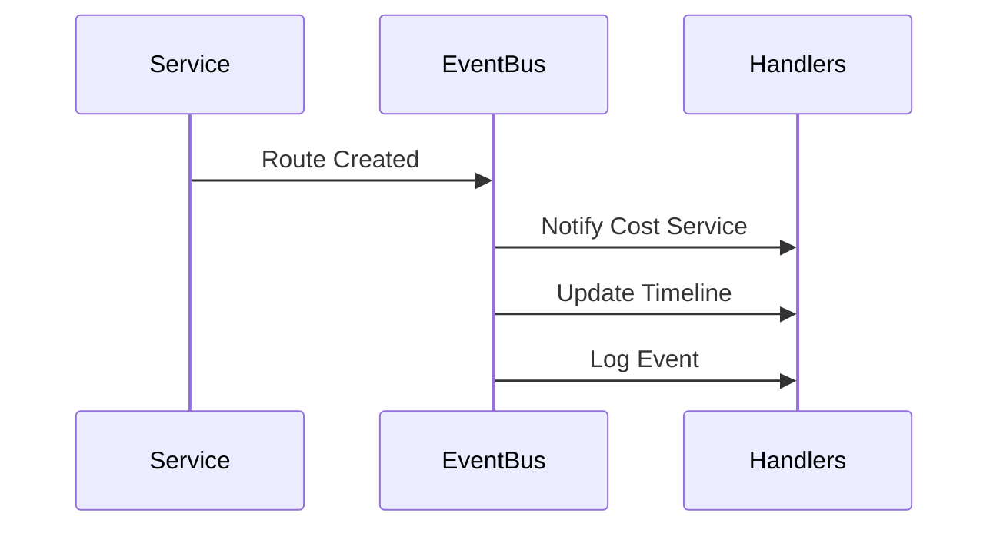

### Infrastructure Layer

For detailed database setup, external service integration, and infrastructure configuration, please refer to [Developer Guide](DEVELOPER_GUIDE.md).

Key architectural aspects:
- PostgreSQL database with migration support
- Repository pattern for data access
- External service integration:
  - Maps API for route planning
  - Weather API for conditions
  - OpenAI for insights and fun facts
- Infrastructure configuration management

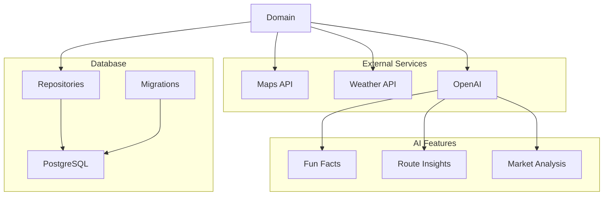

The AI integration provides:
- Route-specific fun facts and insights
- Market analysis and recommendations
- Cost optimization suggestions
- All powered by OpenAI's language models

## 5. Domain Models

Key domain entities and their relationships:

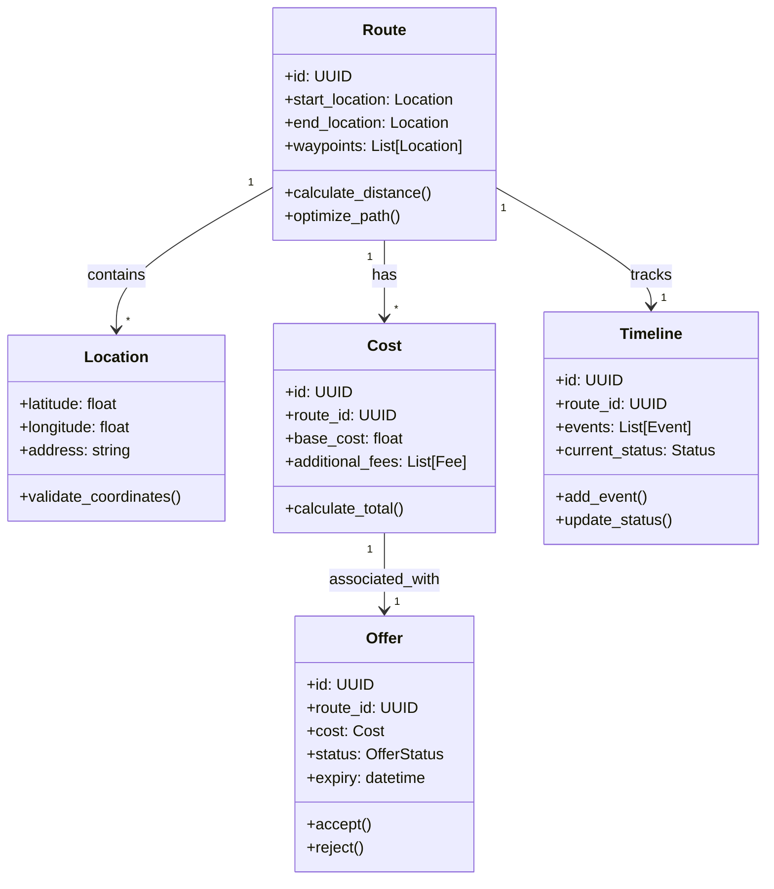

Value Objects:
- `Location`: Immutable coordinates and address
- `Fee`: Cost component with amount and reason
- `OfferStatus`: Enumeration of possible offer states
- `Event`: Timeline event with timestamp and details
- `Status`: Current state of route execution

For detailed implementation and validation rules, see [Developer Guide](DEVELOPER_GUIDE.md).

## 6. Service Layer

Key service interactions and patterns:

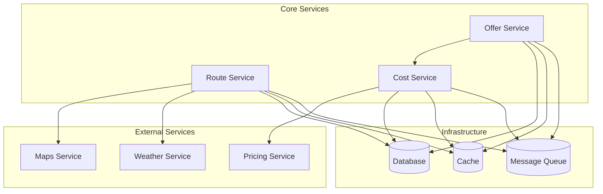

Key Service Patterns:
- Command/Query Responsibility Segregation (CQRS)
- Event-driven communication between services
- Repository pattern for data access
- Caching strategy for performance optimization

For detailed service implementations and patterns, see [Developer Guide](DEVELOPER_GUIDE.md).

## 7. Cross-Cutting Concerns

### Security
- Authentication using JWT tokens
- Role-based access control (RBAC)
- API endpoint protection
- Secure data storage and transmission

### Error Handling
- Centralized error handling middleware
- Structured error responses
- Error logging and monitoring
- Graceful degradation strategies

### Configuration Management
- Environment-based configuration
- Secure secrets management
- Feature flags system
- External service configuration

### Performance
- Response time optimization
- Database query optimization
- Caching strategies
- Resource usage monitoring

For detailed implementation of these concerns, see [Developer Guide](DEVELOPER_GUIDE.md).

## 8. References

- [Frontend Guide](FRONTEND_GUIDE.md) - Detailed frontend implementation
- [Developer Guide](DEVELOPER_GUIDE.md) - Development setup and patterns
- [Testing Infrastructure](TESTING_INFRASTRUCTURE.md) - Testing strategy and setup

## Testing Strategy

The project follows a comprehensive testing strategy:

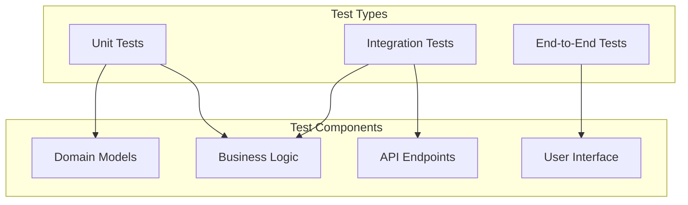

Key testing aspects:
- Unit tests for domain models and business logic
- Integration tests for API endpoints and service interactions
- End-to-end tests for complete user flows
- Test fixtures and factories for consistent test data
- Mocking of external services for reliable testing

Directory structure:
```
tests/
├── unit/          # Unit tests for models and services
├── integration/   # Integration tests for API and services
└── e2e/           # End-to-end tests for user flows
```
Each test type serves a specific purpose:
- Unit tests: Verify individual components in isolation
- Integration tests: Validate component interactions
- E2E tests: Ensure complete user flows work correctly


# LoadApp.AI Architecture

## 1. System Overview

LoadApp.AI is a route planning and cost optimization system built with a layered architecture. The system processes route requests, calculates costs, and provides optimized delivery solutions.

### Core Architecture

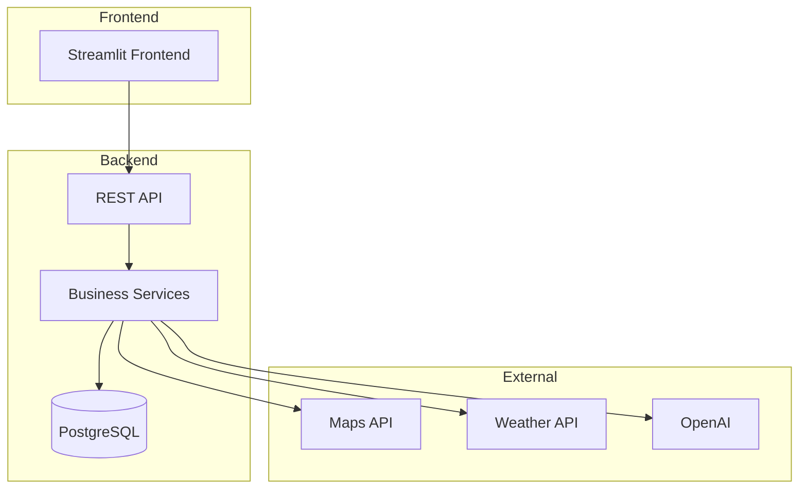

### Request Flow

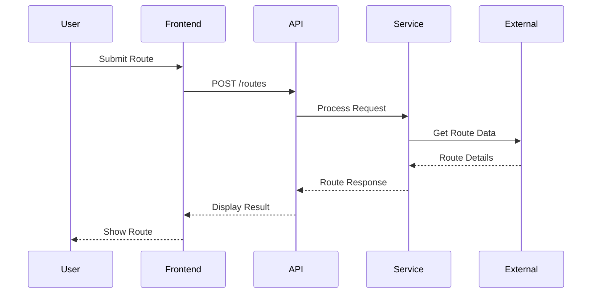

### System Components

1. **Frontend**
   - Streamlit web interface
   - Route input and display
   - Cost visualization

2. **Backend**
   - REST API endpoints
   - Business logic processing
   - Data persistence

3. **External Services**
   - Maps for route planning
   - Weather data integration
   - AI for optimization

## 2. Core Principles

### Clean Architecture

The system follows clean architecture principles to maintain separation of concerns and dependency rules:

1. **Independence of Frameworks**
   - Core business logic is isolated from external frameworks
   - Framework code is treated as a plugin to the system

2. **Testability**
   - Business rules can be tested without UI, database, or external services
   - Tests run quickly and independently

3. **UI Independence**
   - The UI can change without affecting business rules
   - Streamlit could be replaced without changing core logic

4. **Database Independence**
   - Business rules are not bound to database
   - PostgreSQL could be replaced with minimal impact

### Domain-Driven Design

The system implements key DDD concepts:

1. **Ubiquitous Language**
   - Route planning terminology
   - Cost calculation concepts
   - Delivery optimization terms

2. **Bounded Contexts**
   - Route management
   - Cost calculation
   - Delivery optimization

3. **Aggregates**
   - Route (root) with locations
   - Cost with components
   - Delivery with timeline

### SOLID Principles

1. **Single Responsibility**
   - Each service handles one aspect of business logic
   - Components have focused responsibilities

2. **Open/Closed**
   - New route types can be added without modifying existing ones
   - Cost calculations are extensible

3. **Interface Segregation**
   - Focused service interfaces
   - Specific client requirements

4. **Dependency Inversion**
   - High-level modules independent of low-level ones
   - Both depend on abstractions

## 3. Domain Models

The system is built around these core domain models:

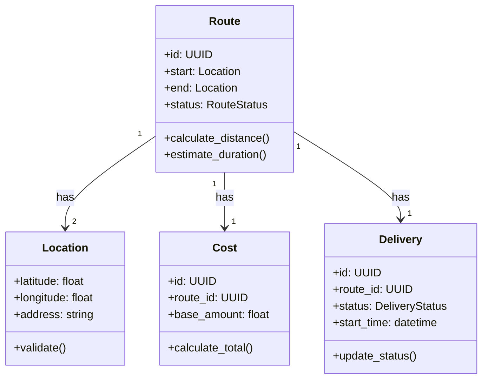

### Core Entities

1. **Route**
   - Central aggregate root
   - Manages start and end locations
   - Handles route optimization
   - Tracks delivery status

2. **Location**
   - Value object for coordinates
   - Address validation
   - Geocoding support

3. **Cost**
   - Calculates delivery costs
   - Handles price adjustments
   - Manages cost history

4. **Delivery**
   - Tracks delivery progress
   - Manages delivery status
   - Handles timeline events

### Value Objects

1. **RouteStatus**
   - PENDING
   - ACTIVE
   - COMPLETED
   - CANCELLED

2. **DeliveryStatus**
   - SCHEDULED
   - IN_PROGRESS
   - DELIVERED
   - FAILED

3. **Coordinates**
   - Latitude/Longitude pair
   - Validation rules
   - Distance calculations

## 4. Service Layer

The service layer orchestrates business operations and external service integrations.

### Core Services

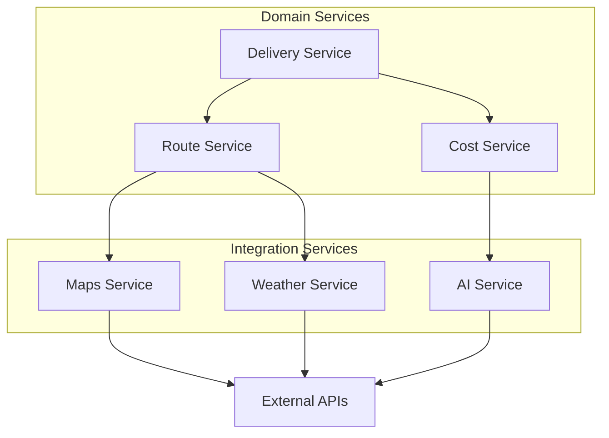

### Service Responsibilities

1. **Route Service**
   - Route planning and optimization
   - Distance calculations
   - Location validation
   - Maps API integration

2. **Cost Service**
   - Base cost calculation
   - Dynamic pricing
   - Cost optimization
   - AI-powered suggestions

3. **Delivery Service**
   - Delivery scheduling
   - Status management
   - Timeline tracking
   - Weather integration

### Integration Patterns

1. **External Services**
   - Adapter pattern for APIs
   - Circuit breaker for resilience
   - Retry policies
   - Fallback strategies

2. **Internal Communication**
   - Synchronous for critical paths
   - Service interfaces
   - Dependency injection
   - Error propagation

## 5. Cross-Cutting Concerns

### Security

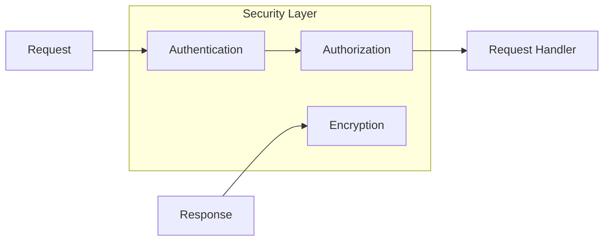

1. **Authentication**
   - JWT-based tokens
   - Secure session management
   - Token refresh mechanism

2. **Authorization**
   - Role-based access control
   - Resource permissions
   - API endpoint protection

### Error Handling

1. **Global Strategy**
   - Centralized error middleware
   - Consistent error formats
   - Proper status codes
   - Error logging

2. **Recovery Mechanisms**
   - Graceful degradation
   - Fallback options
   - Retry mechanisms
   - Circuit breakers

### Configuration

1. **Environment Management**
   - Development settings
   - Production configs
   - Testing environments
   - Secrets management

2. **Feature Flags**
   - Gradual rollouts
   - A/B testing
   - Emergency toggles
   - Beta features

### Monitoring

1. **System Health**
   - Performance metrics
   - Error rates
   - API latencies
   - Resource usage

2. **Business Metrics**
   - Route efficiency
   - Cost accuracy
   - Delivery success rates
   - User satisfaction

## 6. References

### Documentation

For detailed implementation guides, please refer to:

1. **[Frontend Guide](FRONTEND_GUIDE.md)**
   - UI components
   - State management
   - API integration
   - Styling guidelines

2. **[Developer Guide](DEVELOPER_GUIDE.md)**
   - Setup instructions
   - Development workflow
   - Code standards
   - Testing practices

3. **[Testing Infrastructure](TESTING_INFRASTRUCTURE.md)**
   - Test organization
   - Testing strategies
   - Mock services
   - CI/CD integration

### External Resources

1. **APIs**
   - Maps API documentation
   - Weather API reference
   - OpenAI API guides

2. **Technologies**
   - Streamlit documentation
   - Flask API reference
   - PostgreSQL guides
   - Python best practices